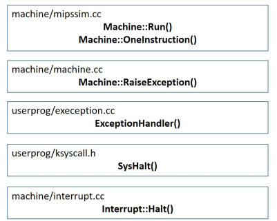
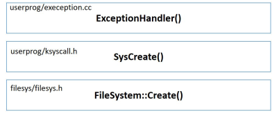

# MP1 System Call

## Trace code

*** 

### SC_Halt



*  There is one stub per system call, that defined in `start.S`

* [start.S](code/test/start.S)
  * Store System call type into register2
  * Execute `system call`
  * Return to register31 that user program counter

```assembly
	.globl Halt
	.ent   Halt
Halt:
	addiu $2,$0,SC_Halt
	syscall
	j	$31
	.end Halt
```

* Machine::Run()
  * Execute `syscall` by this API
  * The actual important execution instruction is `OneInstruction(...)`
```cc
class Instruction {
  public:
    void Decode();	// decode the binary representation of the instruction

    unsigned int value; // binary representation of the instruction

    char opCode;     // Type of instruction.  This is NOT the same as the
    		     // opcode field from the instruction: see defs in mips.h
    char rs, rt, rd; // Three registers from instruction.
    int extra;       // Immediate or target or shamt field or offset.
                     // Immediates are sign-extended.
};

void
Machine::Run()
{
    Instruction *instr = new Instruction;  // storage for decoded instruction

    if (debug->IsEnabled('m')) {
        cout << "Starting program in thread: " << kernel->currentThread->getName();
		cout << ", at time: " << kernel->stats->totalTicks << "\n";
    }
    kernel->interrupt->setStatus(UserMode);
    for (;;) {
        OneInstruction(instr);
		kernel->interrupt->OneTick();
		if (singleStep && (runUntilTime <= kernel->stats->totalTicks))
	  		Debugger();
    }
}
```

* Machine::OneInstruction()
  * Execute one instruction from a user-level program
  * Raise `SyscallException` exception by function `RaiseException(SyscallException, .)`
```cc
void
Machine::OneInstruction(Instruction *instr)
{
    ...
    switch (instr->opCode) {
        ...
        case OP_SYSCALL:
	RaiseException(SyscallException, 0);
	return; 
        ...
    }
    ...
}
```

* RaiseException()
  * `ExceptionType` will be further passed to `ExceptionHandler(...)` for processing
  * `kernel->interrupt->setStatus(SystemMode)` Change to `System mode` before execute `ExceptionHandler()`

```cc
void
Machine::RaiseException(ExceptionType which, int badVAddr)
{
    DEBUG(dbgMach, "Exception: " << exceptionNames[which]);
    registers[BadVAddrReg] = badVAddr;
    DelayedLoad(0, 0);			// finish anything in progress
    kernel->interrupt->setStatus(SystemMode);
    ExceptionHandler(which);		// interrupts are enabled at this point
    kernel->interrupt->setStatus(UserMode);
}
```

* ExceptionHandler()
  * `kernel->machine->ReadRegister(2)` read the register2 value
  * Goto the switch case corresponding to the `type`
  * Specifically execute `SysHalt()`

```cc
// machine.h
enum ExceptionType { NoException,           // Everything ok!
		     SyscallException,      // A program executed a system call.
		     PageFaultException,    // No valid translation found
		     ReadOnlyException,     // Write attempted to page marked 
					    // "read-only"
		     BusErrorException,     // Translation resulted in an 
					    // invalid physical address
		     AddressErrorException, // Unaligned reference or one that
					    // was beyond the end of the
					    // address space
		     OverflowException,     // Integer overflow in add or sub.
		     IllegalInstrException, // Unimplemented or reserved instr.
		     
		     NumExceptionTypes
};

ExceptionHandler(ExceptionType which)
{
    int type = kernel->machine->ReadRegister(2);
	int val;
    int status, exit, threadID, programID;
	int size;
	int id;
	DEBUG(dbgSys, "Received Exception " << which << " type: " << type << "\n");
    switch (which) {
    case SyscallException:
      	switch(type) {
      	case SC_Halt:
			DEBUG(dbgSys, "Shutdown, initiated by user program.\n");
			SysHalt();
			ASSERTNOTREACHED();
			break;
        ...
        }
    ...
}
```

* SysHalt()
  * Kernel be deleted in the function final(So OS shutdown because `kernel` link all components)
```cc
void SysHalt()
{
  kernel->interrupt->Halt();
}


// interrupt.cc
//----------------------------------------------------------------------
// Interrupt::Halt
// 	Shut down Nachos cleanly, printing out performance statistics.
//----------------------------------------------------------------------
void
Interrupt::Halt()
{
    cout << "Machine halting!\n\n";
    cout << "This is halt\n";
    kernel->stats->Print();
    delete kernel;	// Never returns.
}
```

***

### SC_Create



* ExceptionHandler()
  * Part of steps are the same as above
  * `kernel->machine->ReadRegister(4)` read register4 system call args1 (filename)
  * `kernel->machine->WriteRegister(2, (int) status)` The result of the system call, if any, must be put back into r2
  * `WriteRegister` after `SysCreate`
    * Update `PrevPCReg`, `PCReg`, `NextPCReg`
    * set previous programm counter (debugging only)
    * set programm counter to next instruction (all Instructions are 4 byte wide)
    * set next programm counter for brach execution
```cc
ExceptionHandler(ExceptionType which)
{
    int type = kernel->machine->ReadRegister(2);
	int val;
    int status, exit, threadID, programID;
	int size;
	int id;
	DEBUG(dbgSys, "Received Exception " << which << " type: " << type << "\n");
    switch (which) {
    case SyscallException:
      	switch(type) {
      	...
		case SC_Create:
			val = kernel->machine->ReadRegister(4);
			{
			char *filename = &(kernel->machine->mainMemory[val]);

			// return value
			// 1: success
			// 0: failed
			status = SysCreate(filename);

			if(status != -1) status = 1;
			kernel->machine->WriteRegister(2, (int) status);
			}
			kernel->machine->WriteRegister(PrevPCReg, kernel->machine->ReadRegister(PCReg));
			kernel->machine->WriteRegister(PCReg, kernel->machine->ReadRegister(PCReg) + 4);
			kernel->machine->WriteRegister(NextPCReg, kernel->machine->ReadRegister(PCReg)+4);
			return;
			ASSERTNOTREACHED();
            break;
        ...
        }
}


// machine.cc
void 
Machine::WriteRegister(int num, int value)
{
    ASSERT((num >= 0) && (num < NumTotalRegs));
    registers[num] = value;
}
```

* SC_Create()

```cc
int SysCreate(char *filename)
{
	// return value
	// 1: success
	// 0: failed
	return kernel->interrupt->CreateFile(filename);
}


// interrupt.cc
int
Interrupt::CreateFile(char *filename)
{
    return kernel->CreateFile(filename);
}
```

* FileSystem::Create()
    * Specifically call the `open` in `stdlib` (so call stub file system)
```cc
// makefile
DEFINES =  -DFILESYS_STUB -DRDATA -DSIM_FIX


#ifdef FILESYS_STUB 		// Temporarily implement file system calls as 
				// calls to UNIX, until the real file system
				// implementation is available
class FileSystem {
  public:
    FileSystem() { for (int i = 0; i < 20; i++) fileDescriptorTable[i] = NULL; }

    bool Create(char *name) 
	{
        int fileDescriptor = OpenForWrite(name);

        if (fileDescriptor == -1) return FALSE;
        Close(fileDescriptor); 
        return TRUE; 
	}
}

int
OpenForWrite(char *name)
{
    int fd = open(name, O_RDWR|O_CREAT|O_TRUNC, 0666);
    ASSERT(fd >= 0); 
    return fd;
}
```